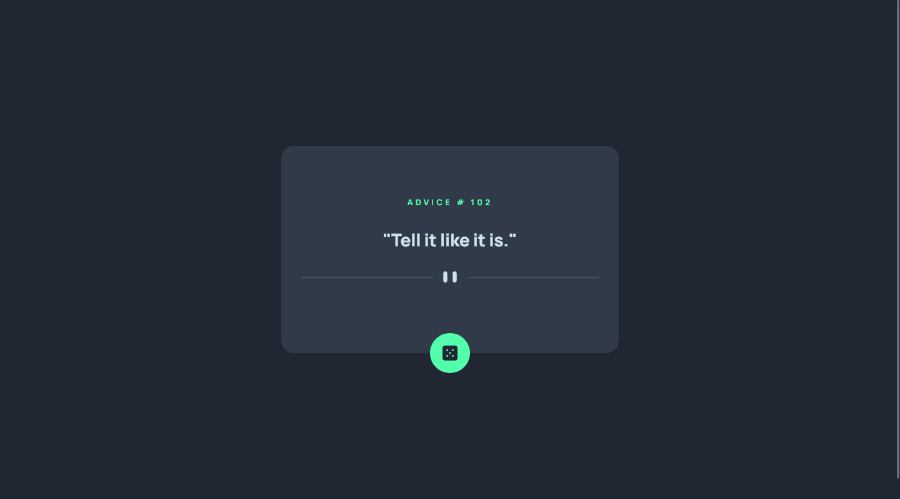

# Frontend Mentor - Advice generator app solution

This is a solution to the [Advice generator app challenge on Frontend Mentor](https://www.frontendmentor.io/challenges/advice-generator-app-QdUG-13db). Frontend Mentor challenges help you improve your coding skills by building realistic projects.

## Table of contents

- [Overview](#overview)
  - [Screenshot](#screenshot)
  - [Links](#links)
- [My process](#my-process)
  - [Built with](#built-with)
  - [What I learned](#what-i-learned)
  - [Useful resources](#useful-resources)
- [Author](#author)

## Overview

### Screenshot



### Links

- Solution URL: [GitHub](https://github.com/GrzywN/advice-generator-app-main)
- Live Site URL: [Netlify](https://amazing-curran-03cd75.netlify.app/)

## My process

### Built with

- Semantic HTML5 markup
- SASS && CSS custom properties
- SASS preprocessor
- Flexbox
- Vanilla JavaScript using fetch()
- Built with [Parcel](https://parceljs.org/)

### What I learned

I learned to code simple async/await functions using fetch. Also, I used try and catch blocks for the first time.

```js
async function getData() {
  try {
    const response = await fetch("https://api.adviceslip.com/advice", {
      cache: "no-cache",
    });
    const data = await response.json();
    heading.innerText = `Advice # ${data.slip.id}`;
    quote.innerText = `"${data.slip.advice}"`;
  } catch (error) {
    console.log(error);
  }
}
```

### Useful resources

- [developer.mozilla.org](https://developer.mozilla.org/en-US/docs/Web/API/Fetch_API/Using_Fetch) - This helped me a lot with using fetch in JavaScript and to understand APIs and JSON better.
- [kursjs.pl](http://kursjs.pl/kurs/ajax/fetch) - This helped me a lot in using fetch, promises and async/await functions, unfortunately it is only in Polish.

## Author

- Frontend Mentor - [Frontend Mentor | GrzywN's profile](https://www.frontendmentor.io/profile/GrzywN)
- Twitter - [@GrzywN](https://twitter.com/grzywn)
